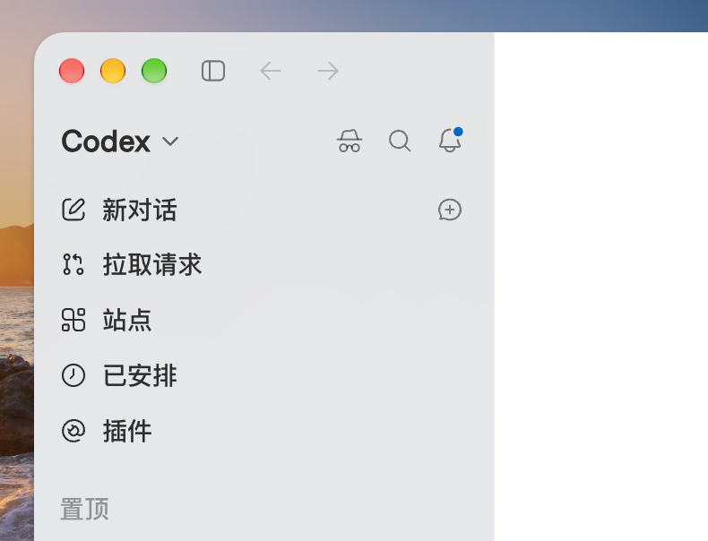

<p align="right"><strong><a href="./README.md">English</a></strong> | 简体中文</p>

<div align="center">
  
  <h1>Incodex</h1>
  <p><em>给本机 Codex 桌面端加一扇无痕窗口。</em></p>
</div>

<p align="center">
  <a href="https://github.com/daftAI2026/incodex/stargazers"></a>
  <a href="https://github.com/daftAI2026/incodex/releases"></a>
  <a href="LICENSE"></a>
  <a href="https://github.com/daftAI2026/incodex/commits"></a>
  <a href="https://github.com/daftAI2026/incodex/actions/workflows/ci.yml"></a>
  <a href="https://x.com/singkid9527"></a>
</p>

<p align="center">
  
</p>

> 这是非官方工具。短命令是 `inc`，和 `incodex` 是同一个程序。

## Features

- **无痕窗口**：登录和设置跟平时一样，看不到以前的对话，这次的聊天也不会进平时的列表
- **侧栏按钮**：装进正在用的 Codex 后，搜索左边会出现帽子墨镜；`Shift+Command+N` 也能开
- **关窗即焚**：正常关掉后清掉这次的临时会话（含独立 Chromium 档案）；登录和设置会留着
- **可选不改包**：`incodex open` 直接开一扇无痕窗，不碰官方签名
- **本机 CLI**：终端菜单、Homebrew / 脚本安装、`status` / `doctor` / `runtime`，不经过官方插件

这还不是「本机完全不留记录」的取证结论。

## Quick Start

**支持平台：** Apple Silicon（arm64）和 Intel（x86_64）Mac。当前不支持 Windows 或 Linux，因为 Incodex 依赖 macOS 的 Codex 应用包、代码签名、钥匙串和 Launch Services。

**Install via Homebrew**

```bash
brew install daftAI2026/tap/incodex
```

只把 `incodex` 和 `inc` 放到 PATH。改 Codex 仍然是随后那条 `incodex install`。更新用 `brew upgrade incodex`。

**Or via script**

```bash
curl -fsSL https://raw.githubusercontent.com/daftAI2026/incodex/main/install.sh | bash
```

**从源码**

```bash
git clone https://github.com/daftAI2026/incodex.git
cd incodex
cargo install --locked --path crates/incodex-cli
```

Homebrew 和脚本安装直接使用预编译的原生 Rust 二进制，不需要 Bun。从源码安装需要稳定版 Rust 和已安装的 Codex / ChatGPT 桌面端；只有参与开发、重建 Electron Runtime 时才需要 [Bun](https://bun.sh) 1.3.14（见 `.bun-version`）。

**Run**

```bash
inc                         # 交互菜单（终端里）
incodex --help
incodex --version

incodex install             # 打进正在用的官方 Codex
incodex install --dry-run   # 只看计划
incodex install --yes       # 没有终端时必须加
incodex install --clone     # 开发：打到副本

incodex uninstall           # 还原官方包
incodex status
incodex doctor
incodex runtime             # 只更新按钮逻辑，不重签 Codex
incodex open                # 不改官方包，直接开无痕窗
incodex recover --transaction <id>
incodex update              # 更新这个 CLI（脚本安装）
incodex self-uninstall      # 卸掉 CLI；还原 Codex 要加 --restore-app
```

**Preview safely**

```bash
incodex install --dry-run
incodex uninstall --dry-run
incodex open --dry-run
incodex update --dry-run
incodex self-uninstall --dry-run
incodex status --json
incodex doctor --json
```

`brew install`、`curl … | bash`、`cargo install` 都只把命令装到 PATH。改 `/Applications/ChatGPT.app` 的是随后那条 `incodex install`。

## Security & Safety Design

Incodex 会改本机已安装的 Electron 应用包。高风险操作默认要看计划：TTY 问一次，非 TTY 要 `--yes`，`--dry-run` 只打印。

- 官方插件加不了这个按钮，必须改应用包
- 改包之后没法继续用一份有效的 OpenAI 签名。第一次开无痕窗，系统可能要你输入 **Mac 登录密码**（钥匙串里的 Codex Storage Key）。选 **始终允许**。这不是 ChatGPT 账号密码
- 因此官方 **智能快照**（拍照 / 截屏附件，英文 Appshot）会不可用。这不是相机权限没开。Computer Use 一般还能用。`incodex uninstall` 后快照会恢复
- 漏洞请走 [SECURITY.md](SECURITY.md)，不要开公开 issue

## Tips

- 官方升级会冲掉补丁。再跑一次 `incodex install`，打的是**当前这份**新官方包
- 如果官方已经升成新版本，`incodex uninstall` 不会用旧备份盖回去
- 原始包备份按应用路径隔离，在 `~/.incodex/installations/`
- Homebrew 装的用 `brew upgrade incodex`；脚本装的用 `incodex update`；源码更新用 `git pull && cargo install --locked --path crates/incodex-cli`；源码卸载用 `cargo uninstall incodex`
- 菜单支持方向键、Vim `j/k`、数字立刻执行、`V` 看版本、`q` 退出
- 脚本安装若找不到命令，把 `~/.local/bin` 加进 PATH
- 按钮和说明跟主窗口语言走

## Features in Detail

### Interactive menu

终端里直接跑 `inc`：

```
  _____   _   _    _____    ____    _____    ______  __   __
 |_   _| | \ | |  / ____|  / __ \  |  __ \  |  ____| \ \ / /
   | |   |  \| | | |      | |  | | | |  | | | |__     \ V /
   | |   | . ` | | |      | |  | | | |  | | |  __|     > <
  _| |_  | |\  | | |____  | |__| | | |__| | | |____   / . \
 |_____| |_| \_|  \_____|  \____/  |_____/  |______| /_/ \_\

  https://github.com/daftAI2026/incodex
  Incognito toggle for Codex desktop.

➤ 1. Open        Open an incognito window without patching
  2. Install     Patch the Codex app you are using
  3. Uninstall   Restore the official Codex app
  4. Status      Show whether Incodex is installed
  5. Doctor      Diagnose the install and leftover sessions
  6. Quit        Exit this menu

↑↓ | Enter | V Version | Q Quit | 1-6 Jump
```

### Install

```bash
$ incodex install

➤ Install
  App          /Applications/ChatGPT.app
  Version      26.814.41957 6744
  Signed       yes
  ! Replaces the app in place and resigns it ad hoc.
  ! Official Appshot (smart snapshot) stops until uninstall.
  Backup       ~/.incodex/installations/
  ✓ Official app patched
  Install id   0778f0fa-…
  Runtime      0.3.1
  App          /Applications/ChatGPT.app
➤ Relaunch
  ✓ ChatGPT.app relaunched.
```

装进去之后，搜索左边会出现帽子墨镜。点它或 `Shift+Command+N` 开无痕窗。

### Open without patching

```bash
$ incodex open --dry-run

➤ Open incognito without patching Codex
  App          /Applications/ChatGPT.app
  Binary       /Applications/ChatGPT.app/Contents/MacOS/ChatGPT
  ! Dry run. No window opened.
```

关窗后隔离会话会被清掉：

```bash
$ incodex open

➤ Opening incognito window
  Binary       /Applications/ChatGPT.app/Contents/MacOS/ChatGPT
  Home         ~/.incodex/sessions/…
  ✓ Closed. Isolated session removed.
```

### Status

```bash
$ incodex status

➤ Status
  App          /Applications/ChatGPT.app
  Exists       yes
  Installed    yes
  Loader       asar loader only
  Runtime      0.3.1 releases/0.3.1
  Version      26.814.41957 6744
  Install id   0778f0fa-…
  Target       official-404f3389062b
  Main         .vite/build/early-bootstrap.js
```

### Doctor

```bash
$ incodex doctor

➤ App
  Path         /Applications/ChatGPT.app
  Exists       yes
  Installed    yes
  Bundle       com.openai.codex
  Version      26.814.41957 6744
  Arch         arm64

➤ Runtime
  Version      0.3.1
  External     0.3.1 releases/0.3.1
  Loader       asar only
  Main         .vite/build/early-bootstrap.js

➤ Signing
  Verify       ok
  Hardened     yes
  Gatekeeper   not accepted (diagnostic)

➤ Backup
  State        ok
  Matches      yes

➤ Sessions
  Orphans      0
  Chromium     0
  Stale pid    no
  Journals     0
```

Gatekeeper 那一行是诊断，不是安装失败。改包之后官方签名本来就不会过 Gatekeeper。

### Version

```bash
$ incodex --version

Incodex version 0.3.1
macOS: 26.6
Architecture: arm64
Kernel: 25.6.0
SIP: Enabled
Disk Free: 120.00GB
Install: Homebrew
Shell: /bin/zsh
```

`Install` 会区分 Homebrew、脚本和源码。Homebrew 装的不要跑 `incodex update`，用 `brew upgrade incodex`。

## License

MIT，完整文本见 [LICENSE](./LICENSE)。第三方声明见 [NOTICE](./NOTICE)。

- `src/runtime/incognito-copy.ts` 里的翻译文案是 Incodex 原作，同样按 MIT 授权
- Codex / ChatGPT 的名称、图标和官方应用本身属于 OpenAI，本仓库不授予那些材料的许可
